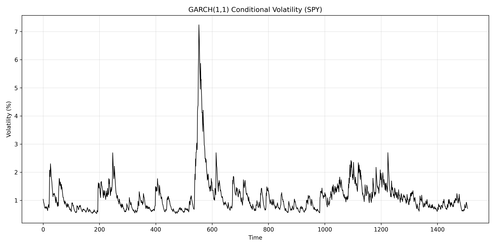

# Volatility Modeling using GARCH

This project studies time-varying volatility in financial markets using a GARCH(1,1) model.  
The analysis is performed on daily returns of the S&P 500 ETF (SPY).

The goal is to understand volatility clustering and persistence rather than to build a trading strategy.

---

## Data
- Asset: SPY (S&P 500 ETF)
- Frequency: Daily
- Period: 2018–2024
- Prices are auto-adjusted for dividends and splits
- Returns are computed as simple daily percentage changes and scaled to percentages

---

## Model

### GARCH(1,1)
The model assumes that conditional volatility depends on:
- The magnitude of recent return shocks
- Past volatility levels

This structure captures volatility clustering commonly observed in equity markets.

Key parameters:
- **alpha**: sensitivity to new shocks
- **beta**: volatility persistence

---

## Results

The estimated GARCH(1,1) model shows strong volatility persistence, consistent with empirical financial literature.

The plot below displays the conditional volatility estimated by the model over time.

---

## Interpretation
- Volatility is clearly time-varying rather than constant
- Periods of high volatility tend to cluster
- The sum of alpha and beta close to one indicates persistent volatility dynamics

---

## Limitations
- Assumes a specific parametric form for volatility dynamics
- Does not model jumps or regime switches
- Not intended as a trading or forecasting strategy

---

## Potential Extensions
- Volatility forecasting and evaluation
- Alternative distributions (e.g., Student-t)
- Comparison with constant-volatility models
- Multi-asset or portfolio volatility modeling

---

## Tools
Python, NumPy, Pandas, Matplotlib, yfinance, arch
